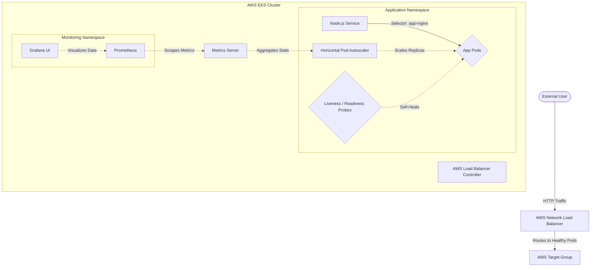
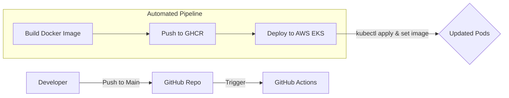

# 🚀 DevOps Self-Healing Platform (AWS EKS + Kubernetes)

[](https://aws.amazon.com/eks/)
[](https://kubernetes.io/)
[](https://www.terraform.io/)
[](https://github.com/features/actions)
[](https://prometheus.io/)
[](https://grafana.com/)
[](#)

## 📖 Overview

> **"I didn't just 'use AWS'. I built an autonomous system that detects failures and recovers without human intervention."**

This is a production-grade **Self-Healing Platform** designed to showcase advanced DevOps engineering. It goes beyond basic deployment by implementing an autonomous feedback loop that monitors application health, intercepts failures, and dynamically scales resources based on real-time traffic demand.

---

## 🛠️ Technology Stack

| Category | Tools |
| :--- | :--- |
| **Cloud Infrastructure** | AWS (EKS, VPC, NLB, IAM) |
| **Infrastructure as Code** | Terraform |
| **Containerization** | Docker, GitHub Container Registry (GHCR) |
| **Orchestration** | Kubernetes |
| **CI/CD Pipeline** | GitHub Actions |
| **Observability** | Prometheus, Grafana |
| **Security** | Kubernetes Secrets, OIDC |

---

## 🏗️ Architecture & Flow

### System Architecture


### CI/CD Pipeline (GitHub Actions + GHCR)


---

## 🛡️ Core Capabilities

### 1. 🩺 Autonomous Self-Healing
- **Liveness Probes**: Automatically restarts a container if it enters a deadlock or fatal state.
- **Readiness Probes**: Ensures zero-downtime deployments by only routing traffic to pods that are fully initialized.
- **Auto-Recovery**: Leveraging Kubernetes `ReplicaSets` to maintain the desired state (2 replicas) even during node failures.

### 2. 📈 Elastic Scalability
- **Horizontal Pod Autoscaling (HPA)**: Dynamically scales from **2 to 10 replicas** based on CPU thresholds (>50%), ensuring performance during traffic spikes.

### 3. 🔍 Full-Stack Observability
- **Prometheus**: Scrapes metrics from the cluster and application.
- **Grafana**: Provides a "Single Pane of Glass" to visualize cluster health and traffic patterns.
- **Intelligent Alerting**: Configured to notify on high latency or sustained pod restarts.

---

## 📁 Repository Structure

```text
/
├── .github/workflows/  # CI/CD Pipeline (GHCR + EKS)
├── app/                # Node.js Application Source
├── infrastructure/     # IaC (Terraform) for EKS Cluster
├── k8s/                # Kubernetes Manifests (Deployment, Service, HPA)
├── monitoring/         # Observability (Prometheus/Grafana Configs)
├── argocd/             # GitOps Manifests (Future Roadmap)
└── docs/               # Technical Deep Dives
```

---

## 🚀 Setup & Deployment

### 1. Provision Cluster (Terraform)
```bash
cd infrastructure/terraform
terraform init
terraform apply
```

### 2. Configure AWS Access
```bash
aws eks update-kubeconfig --name devops-cluster --region <your-region>
```

### 3. CI/CD Activation
1.  **GitHub Secrets**: Populate the following in your repo:
    - `AWS_ACCESS_KEY_ID`, `AWS_SECRET_ACCESS_KEY`, `AWS_REGION`
    - `EKS_CLUSTER_NAME`
2.  **Push to main**: Any push triggers an automated build/test/deploy cycle.

---

## 🧪 Verification Scenarios

| Scenario | Action | Expected Result |
| :--- | :--- | :--- |
| **Pod Crash** | `kubectl delete pod...` | K8s recreates the pod immediately. |
| **App Lockup** | Hit `/fail` endpoint | Liveness probe fails; container restarts. |
| **High Load** | Run load-generator | HPA scales replicas from 2 up to 10. |
| **New Version** | Git Push Main | Rolling update with zero downtime. |

---

## 🗺️ Roadmap & Future Enhancements

- [ ] **GitOps with ArgoCD**: Implementing continuous delivery via GitOps patterns.
- [ ] **Custom Self-Healing Engine**: A Go-based operator for more complex recovery logic.
- [ ] **Service Mesh (Istio)**: For advanced traffic splitting and mTLS.

---

## 🌐 Documentation
- [**Architecture Deep Dive**](docs/architecture.md)
- [**Self-Healing Logic Flow**](docs/self-healing-flow.md)
