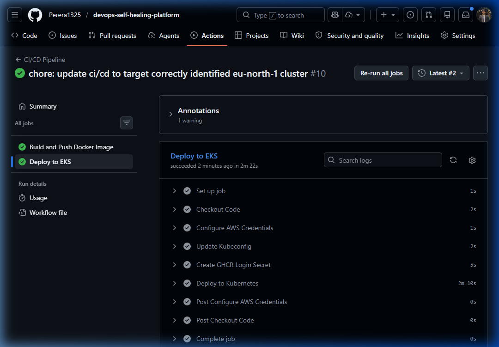
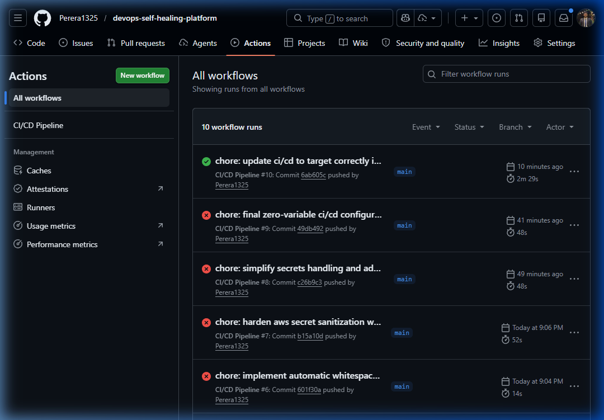
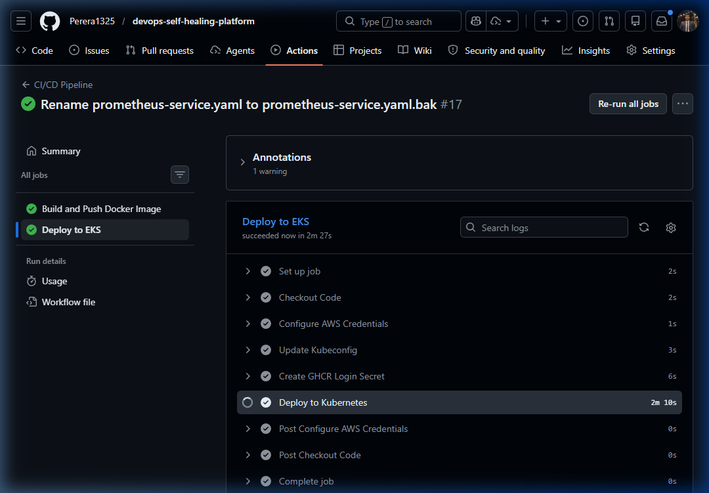

# Self-Healing Platform on Kubernetes (AWS EKS)

## Overview
This project presents a robust, enterprise-grade cloud-native platform deployed on Amazon Elastic Kubernetes Service (EKS). The core objective is to showcase a **Self-Healing and Auto-Scaling Infrastructure**, simulating a production environment where system uptime and reliability are paramount.

In modern cloud architecture, systems must be resilient to unexpected failures, traffic spikes, and application crashes. This platform implements automated recovery mechanisms (self-healing) to detect unresponsiveness and instantly replace failing containers without human intervention, ensuring high availability and seamless user experiences.

## Architecture

```text
GitHub → GitHub Actions (CI/CD) → AWS EKS → Kubernetes → LoadBalancer → Users
```

## Features
- **Automated CI/CD Pipeline:** GitHub Actions automatically builds, packages, and deploys updates directly to the AWS EKS cluster upon new commits.
- **Self-Healing (Pod Restart):** Automated container recovery mechanisms constantly monitor application health and instantly replace crashed or hanging pods.
- **Auto Scaling (HPA):** Horizontal Pod Autoscaler dynamically provisions additional application replicas during traffic spikes (scaling from 2 to 5 pods based on CPU utilization).
- **Health Checks:** Granular Liveness and Readiness probes guarantee that traffic is only routed to fully operational containers.
- **Monitoring:** Integrated Prometheus stack continuously tracks cluster metrics, CPU usage, and pod availability.

## Tech Stack
- **AWS EKS** (Elastic Kubernetes Service)
- **Kubernetes** (Orchestration, HPA, Probes)
- **Docker** (Containerization)
- **GitHub Actions** (Continuous Integration & Continuous Deployment)
- **Prometheus** (Monitoring & Alerting)

## Project Structure
```text
/
├── app/
│   └── Dockerfile                 # Application packaging
├── k8s/
│   ├── deployment.yaml            # Workload definitions & Health probes
│   ├── service.yaml               # LoadBalancer configuration
│   └── hpa.yaml                   # Horizontal Pod Autoscaling rules
├── monitoring/
│   ├── alert-rules.yaml           # Alert triggers (e.g., PodDown)
│   ├── prometheus-deployment.yaml # Prometheus server 
│   └── prometheus-service.yaml    # Internal metrics exposure
└── .github/workflows/
    └── deploy.yml                 # Automated deployment pipeline
```

## Setup Instructions

**1. Clone the repository:**
```bash
git clone https://github.com/Perera1325/devops-self-healing-platform.git
cd devops-self-healing-platform
```

**2. Configure AWS context:**
```bash
aws eks update-kubeconfig --region eu-north-1 --name devops-cluster
```

**3. Deploy the application:**
```bash
kubectl apply -f k8s/
```

**4. Deploy the monitoring stack:**
```bash
kubectl apply -f monitoring/
```

**5. Verify deployment:**
```bash
kubectl get pods,svc,hpa
```

## Demo Steps

**1. Deploy Application**
Verify the baseline deployment is active with 2 replicas:
```bash
kubectl get pods -l app=nginx
```

**2. Kill Pod (Simulate Failure)**
Delete a serving pod to simulate a crash:
```bash
kubectl delete pod <nginx-pod-name>
```

**3. Observe Recovery**
Watch Kubernetes instantly detect the missing pod and spin up a new healthy replacement:
```bash
kubectl get pods -w
```

**4. Trigger Scaling (Stress Test)**
Apply artificial CPU load to trigger the Horizontal Pod Autoscaler:
```bash
kubectl run stress --image=busybox -- /bin/sh -c "while true; do wget -q -O- http://nginx-service; done"
```
Monitor the HPA expanding replicas from 2 up to 5:
```bash
kubectl get hpa -w
```

## Screenshots

*(Kubernetes Pods Running & Configuration)*


*(Workflow Execution Success)*


*(Deploy to Kubernetes Logs - Final Verification)*


## Future Improvements
- **Grafana Dashboards:** Integrate Grafana to dynamically visualize Prometheus metrics on a dedicated web interface.
- **Alerting System:** Configure Alertmanager to send Slack or email notifications based on Prometheus rules.
- **Microservices Architecture:** Evolve the monolithic backend into decoupled microservices with dedicated routing via Istio Service Mesh.
